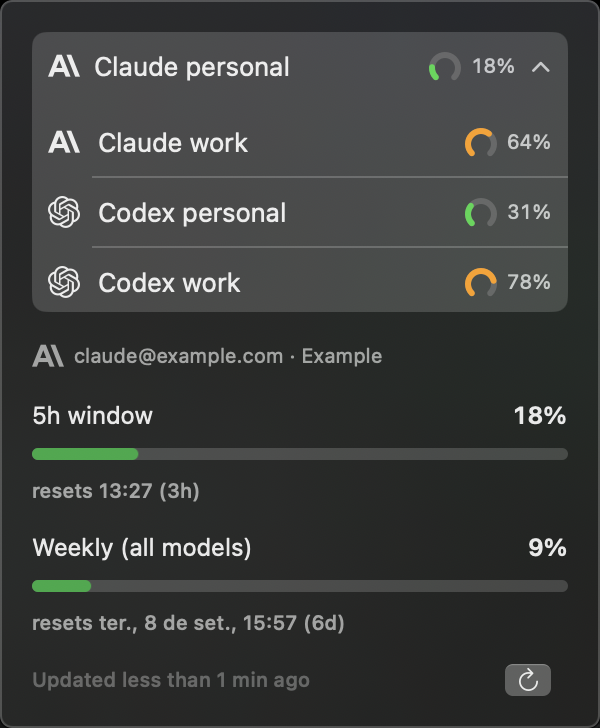

# llm-usage-bar

[](https://github.com/jonasporto/llm-usage-bar/actions/workflows/test.yml)

macOS menu bar gauge for Claude and Codex plan limits. It shows each
account's available usage windows in one provider-aware list, including
Claude per-model buckets and extra-usage spend.



*Two synthetic Claude accounts and two synthetic Codex accounts; all
identities and usage values are examples.*

- **Bar icon:**  — a 270° arc gauge of the
  5h window (green < 60%, orange < 85%, red ≥ 85%) plus the percentage. When
  the window is maxed and extra usage is spending, the text becomes `⚡` and
  the money spent.
- **Popover:** an account picker with Anthropic/OpenAI marks and each account's
  primary gauge, bars with unambiguous localized reset dates, Claude
  extra-usage spend and an approximate available balance, plus Anthropic
  rate-limit countdown with auto-retry.
- **Per-model bars** are read from the payload, so a new model shows up with
  no code change.

## Install

Requires macOS 14+ and a Swift toolchain (Xcode or Command Line Tools).

```bash
git clone https://github.com/jonasporto/llm-usage-bar.git
cd llm-usage-bar
./install.sh
```

The installer builds from source, signs the app ad hoc, installs it at
`~/Applications/Claude Usage.app`, and opens it. It does not use `sudo` or
download executable code. The bundle `Info.plist` (with `LSUIElement`, so
there is no Dock icon) is versioned at `Claude Usage.app/Contents/Info.plist`.
Add the installed app to *System Settings → General → Login Items* to have it
start with your session.

Quit with ⌘Q while the popover is open.

## Accounts

With no configuration the app reads the default Claude Code profile: Keychain
service `Claude Code-credentials` and `~/.claude.json`.

To combine multiple Claude profiles and multiple Codex accounts, list them in
`~/.config/claude-usage-bar/profiles.json` — see
[`profiles.example.json`](profiles.example.json). Existing entries without a
`provider` remain Anthropic profiles.

```json
[
  { "id": "claude-personal", "name": "Claude personal", "provider": "anthropic" },
  { "id": "claude-work", "name": "Claude work", "provider": "anthropic",
    "keychainService": "Claude Code-credentials-abc12345",
    "configPath": "~/.claude-work/.claude.json" },
  { "id": "codex-personal", "name": "Codex personal", "provider": "openai" },
  { "id": "codex-work", "name": "Codex work", "provider": "openai",
    "codexHome": "~/.codex-work" }
]
```

| Field | Provider | Default | Meaning |
| --- | --- | --- | --- |
| `id` | all | required | Stable, globally unique account key |
| `name` | all | the id, capitalized | Account picker label |
| `provider` | all | `anthropic` | `anthropic` or `openai` |
| `keychainService` | Anthropic | `Claude Code-credentials` | Keychain entry Claude Code wrote |
| `configPath` | Anthropic | `~/.claude.json` | Config file that names the account |
| `codexHome` | OpenAI | `~/.codex` | Isolated Codex configuration and login directory |
| `codexPath` | OpenAI | auto-discovered | Optional absolute path to the `codex` executable |

Claude Code derives the Keychain suffix of a non-default profile from its
config dir path, so it differs per machine. Find yours with:

```bash
security dump-keychain | grep "Claude Code-credentials"
```

Codex accounts are isolated by `CODEX_HOME`. Sign in once for every directory
you configure; for example:

```bash
codex login
mkdir -p "$HOME/.codex-work"
CODEX_HOME="$HOME/.codex-work" codex login
```

The app supports ChatGPT-authenticated Codex accounts. API-key authentication
uses usage-based billing and does not expose a plan-limit percentage. If the
app cannot find the Codex CLI when launched from Finder, set `codexPath` to
the absolute path printed by `which codex`.

## Privacy

- Anthropic OAuth tokens are read from the same macOS Keychain entries Claude
  Code writes, via `/usr/bin/security`. They are never displayed, logged or
  written anywhere by this app and are sent only to
  `GET https://api.anthropic.com/api/oauth/usage` in its `Authorization`
  header.
- OpenAI authentication is delegated to `codex app-server` with the selected
  `CODEX_HOME`. The app does not read, display, log or persist Codex
  credentials.
- The balance you type is stored in `UserDefaults` as an anchor
  (`balance:spend-at-that-moment`), never sent anywhere.

## Polling

The visible account is fetched once every 2 minutes, with a 45s throttle per
account. Opening the account picker fills any missing gauges sequentially,
subject to the same throttle and cooldown rules; it does not add background
polling for inactive accounts. Anthropic's usage endpoint rate-limits on a
rolling window and its `Retry-After` is always 0, so Anthropic accounts
additionally use an exponential backoff (60s → 600s) on HTTP 429. Steady state
for the visible account is about 30 refreshes per hour.

## Test

```bash
swift test   # Swift Testing — no XCTest, so Command Line Tools is enough
```

Parsing, money conversion, profile config and the balance anchor live in
`Sources/UsageCore` and are covered by tests; `Sources/ClaudeUsageBar` is the
SwiftUI shell.

## Contributing

Issues and pull requests are welcome — please read
[CONTRIBUTING.md](CONTRIBUTING.md) first. Security reports: see
[SECURITY.md](SECURITY.md).

## License

[MIT](LICENSE)

This is an unofficial community project. It is not affiliated with,
endorsed by, or supported by Anthropic or OpenAI.
