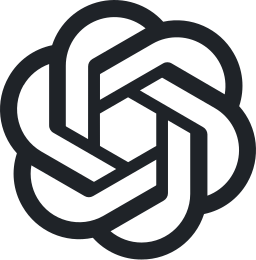

# llm-usage-bar

[](https://github.com/jonasporto/llm-usage-bar/actions/workflows/test.yml)

macOS menu bar gauge for Claude, Codex, Grok and Antigravity plan limits. It
shows each account's available usage windows in one provider-aware list,
including Claude per-model buckets and extra-usage spend.


*Synthetic accounts across providers; all identities and usage values are
examples.*

Install it with one command, then add as many accounts as you like — several
per provider, mixed freely:

```bash
curl -fsSL https://github.com/jonasporto/llm-usage-bar/releases/latest/download/install.sh | sh
```

## Supported providers

| | Provider | `provider` | Where the numbers come from | Sign-in |
| --- | --- | --- | --- | --- |
|  | Claude | `anthropic` *(default)* | The Anthropic OAuth usage endpoint, with Claude Code's Keychain token | `claude` → `/login` |
|  | Codex | `openai` | The local Codex App Server, selected by `CODEX_HOME` | `codex login` |
|  | Grok | `xai`, `grok` | The Grok CLI billing endpoint, with the token in `$GROK_HOME/auth.json` | `grok` → `/login` |
|  | Antigravity | `antigravity`, `agy` | `agy -p /quota` — the CLI owns the credentials | `agy` → sign in |
|  | Anything else | your own string | A one-shot executable you point the app at | yours |

Every row supports **more than one account**, each isolated by its own `home`,
and every account keeps its own gauge in the picker. Adding a provider the app
has never heard of takes no Swift and no clone — see
[Custom providers & overrides](#custom-providers--overrides).

The app never stores, prints or forwards a credential. Where a provider ships
a CLI that already holds the account's session (Codex, Antigravity), the fetch
is delegated to it rather than reimplemented.

- **Bar icon:**  — a 270° arc gauge of the
  5h window (green < 60%, orange < 85%, red ≥ 85%) plus the percentage. When
  the window is maxed and extra usage is spending, the text becomes `⚡` and
  the money spent.
- **Popover:** an account picker with Anthropic/OpenAI/xAI/Antigravity marks and
  each account's primary gauge, bars with unambiguous localized reset dates,
  extra usage spend and an approximate available balance, plus Anthropic
  rate-limit countdown with auto-retry.
- **Per-model bars** are read from the payload, so a new model shows up with
  no code change.

## Install

Requires macOS 14+ and a Swift toolchain (Xcode or Command Line Tools).

```bash
curl -fsSL https://github.com/jonasporto/llm-usage-bar/releases/latest/download/install.sh | sh
```

Or, from a source checkout:

```bash
git clone https://github.com/jonasporto/llm-usage-bar.git
cd llm-usage-bar
./install.sh
```

Either way, the installer leaves you ready to add accounts — no directory to
create, nothing else to download:

| Path | What it is |
| --- | --- |
| `~/.config/llm-usage-bar/profiles.json` | Your accounts. Written with one Claude account if you had none; an existing file (including a pre-rename `~/.config/claude-usage-bar/profiles.json`) is carried over, never overwritten |
| `~/.config/llm-usage-bar/profiles.example.json` | Every field, filled in, to copy rows from |
| `~/.config/llm-usage-bar/icons/` | The four provider marks plus `example.svg`, to start an `icon` override from |
| `~/.local/share/llm-usage-bar/adapters/` | Adapter executables, searched before `$PATH`. Ships with a runnable `example-usage` starter |

`$XDG_CONFIG_HOME` and `$XDG_DATA_HOME` are honored.

Both paths build from source locally, sign the app ad hoc, install it at
`~/Applications/LLM Usage.app`, and open it without `sudo`. The one-line
path downloads a temporary source archive; it does not install a prebuilt
executable. The bundle `Info.plist` (with `LSUIElement`, so there is no Dock
icon) is versioned at `LLM Usage.app/Contents/Info.plist`. A leftover
`Claude Usage.app` in the same install directory is removed. Add the installed
app to *System Settings → General → Login Items* to have it start with your
session. Versioned releases are available on the
[Releases page](https://github.com/jonasporto/llm-usage-bar/releases).

Quit with ⌘Q while the popover is open.

## Accounts

There is no in-app settings screen. Accounts are a JSON file; the popover
picker only **selects** among the rows you listed.

With no configuration the app reads the default Claude Code profile: Keychain
service `Claude Code-credentials` and `~/.claude.json`.

### Add a profile

1. Open the `profiles.json` the installer wrote:
   ```bash
   open -t ~/.config/llm-usage-bar/profiles.json
   ```
   `profiles.example.json` sits next to it with a filled-in row for every
   provider and field, to copy from. *(Installed some other way? Create the
   file at that path — `$XDG_CONFIG_HOME` is honored, and an existing
   `~/.config/claude-usage-bar/profiles.json` is still read.)*
2. Add one JSON object per account. `id` must be unique across the whole file,
   `name` is the picker label, and `provider` is one of the values in
   [Supported providers](#supported-providers) (omit it for Claude).
3. Isolation uses the shared `home` field; each provider interprets it (Claude
   Keychain suffix, `CODEX_HOME`, `GROK_HOME`, a `.gemini` directory for
   Antigravity). A second login is another object with its own `id` and
   `home` — not a `provider` change on an existing row. Optional `path` names
   the provider's CLI when the app cannot find it (Codex, Antigravity).
4. Sign in once for that account (see the provider sections below). Then save
   the file. The picker updates automatically without restarting; a
   half-written or invalid file is ignored so the current accounts stay put.

To use another provider or account, add another object and pick it in the popover. There
is no global provider switch. Removing an object removes that account from the
picker. A duplicate `id` keeps the first row. An unknown `provider` is kept
when a usage executable is found for it — an adapter named after the provider,
or an explicit `path` / `adapter` (see
[Custom providers & overrides](#custom-providers--overrides)).

```json
[
  { "id": "claude-personal", "name": "Claude personal", "provider": "anthropic" },
  { "id": "claude-work", "name": "Claude work", "provider": "anthropic",
    "home": "~/.claude-work" },
  { "id": "codex-personal", "name": "Codex personal", "provider": "openai" },
  { "id": "codex-work", "name": "Codex work", "provider": "openai",
    "home": "~/.codex-work" },
  { "id": "grok-personal", "name": "Grok personal", "provider": "xai" },
  { "id": "grok-work", "name": "Grok work", "provider": "xai",
    "home": "~/.grok-work" },
  { "id": "antigravity-personal", "name": "Antigravity personal", "provider": "antigravity" },
  { "id": "antigravity-work", "name": "Antigravity work", "provider": "antigravity",
    "home": "~/accounts/work/.gemini" },
  { "id": "minimax", "name": "MiniMax", "provider": "minimax",
    "home": "~/.minimax",
    "icon": "~/.config/llm-usage-bar/icons/minimax.svg" }
]
```

| Field | Default | Meaning |
| --- | --- | --- |
| `id` | required | Stable, globally unique account key |
| `name` | the id, capitalized | Account picker label |
| `provider` | `anthropic` | `anthropic`, `openai`, `xai` (`grok` alias), `antigravity` (`agy` alias), or any other id with `path` / `adapter` |
| `home` | the provider's usual directory | Isolation directory (`CLAUDE_CONFIG_DIR`, `CODEX_HOME`, `GROK_HOME`, a `.gemini` directory for Antigravity, or `$HOME/.<provider>`) |
| `path` | auto-discovered | The provider's CLI (Codex, Antigravity), or an unknown provider's usage executable (see [Where adapters are found](#where-adapters-are-found)) |
| `adapter` | none | Overrides the built-in usage fetch with a one-shot executable |
| `icon` | built-in / generic mark | Optional SVG path shown in the picker (overrides built-in provider icon) |

Older keys (`keychainService`, `configPath`, `codexHome`, `codexPath`,
`grokHome`) are still accepted. `home` / `path` win when both are present.

###  Claude (`provider`: `anthropic`)

Sign in with Claude Code on that profile. The default object (`provider`
omitted or `anthropic`, no `home`) is the usual `~/.claude.json` login and
Keychain service `Claude Code-credentials`. A non-default `home` is
`CLAUDE_CONFIG_DIR`: the app reads `$home/.claude.json` and the Keychain
entry Claude Code derived from that path (`Claude Code-credentials-` plus
the first 8 hex characters of SHA-256 of the expanded directory).

###  Codex (`provider`: `openai`)

Codex accounts are isolated by `CODEX_HOME`. Sign in once for every directory
you configure; for example:

```bash
codex login
mkdir -p "$HOME/.codex-work"
CODEX_HOME="$HOME/.codex-work" codex login
```

The app supports ChatGPT-authenticated Codex accounts. API-key authentication
uses usage-based billing and does not expose a plan-limit percentage. If the
app cannot find the Codex CLI when launched from Finder, set `path` to
the absolute path printed by `which codex`.

###  Grok (`provider`: `xai`)

Grok accounts are isolated by `GROK_HOME`. Sign in once for every directory
you configure; for example:

```bash
grok login
mkdir -p "$HOME/.grok-work"
GROK_HOME="$HOME/.grok-work" grok login
```

The app reads the Grok CLI session in `$GROK_HOME/auth.json`. Open `grok` on
that profile when the token expires so the CLI can refresh it. API-key Grok
(`XAI_API_KEY`) uses usage-based billing and does not expose a plan-limit
percentage.

###  Antigravity (`provider`: `antigravity`)

Antigravity accounts default to `~/.gemini` (or a custom directory via `home`).
The active account email is read from `$home/google_accounts.json`.

Quota comes from the Antigravity CLI, which owns the account's credentials —
the app never reads or sends a Google token of its own:

```
agy -p /quota
Gemini Models          Weekly Limit Remaining  0%  2026-09-10T12:46:51Z
Claude and GPT models  Weekly Limit Remaining  0%  2026-09-10T13:11:35Z
```

- Antigravity groups its models, and the models in a group **share one weekly
  limit**: `Gemini Models` covers Gemini Flash and Pro, `Claude and GPT models`
  covers Claude Opus, Claude Sonnet and GPT-OSS. Quota is consumed in
  proportion to token cost, so cheaper models stretch the same limit further.
- Each group is one bar in the popover, with its own reset time. The group that
  has consumed the most drives the menu bar gauge.
- The CLI is found as `agy` or `antigravity` (see
  [Where adapters are found](#where-adapters-are-found)); `path` names it
  explicitly, exactly as it does for the Codex CLI.
- **A second account needs its own `$HOME`.** The CLI has no flag for its
  configuration directory — it always reads `$HOME/.gemini` — so an isolated
  account is a `.gemini` directory with a parent of its own, and that parent
  becomes `$HOME` for the CLI:
  ```json
  { "id": "antigravity-work", "name": "Antigravity work",
    "provider": "antigravity", "home": "~/accounts/work/.gemini" }
  ```
  A `home` that is not named `.gemini` is refused with an explanation rather
  than silently reporting the default account's quota.
- `adapter` (or an `antigravity-usage` / `agy-usage` executable found in the
  usual places) replaces this fetch entirely, for anyone who would rather
  report Antigravity usage their own way.
- Overriding `icon` with a custom SVG is also supported.

### Custom providers & overrides

You do not need a git clone to add new providers or customize existing ones.
Everything is configured in `~/.config/llm-usage-bar/profiles.json`.

#### 1. Customizing built-in providers (Overrides)

You can customize any built-in profile (`anthropic`, `openai`, `xai`, `antigravity`):
- **Custom icon:** Add `"icon": "~/.config/llm-usage-bar/icons/custom.svg"` (or any
  absolute path) to override the provider's default mark in the account picker.
- **Custom usage fetcher:** Add `"adapter": "/path/to/executable"` to bypass
  built-in polling and delegate usage fetching to your own script or binary.

#### 2. Adding a new provider (Ollama, vLLM, MiniMax, etc.)

To add a provider not built into the app:

1. Copy the starter adapter the installer left for you, named after the
   provider you are adding — an adapter called `<provider>-usage` is found by
   name, with no `path` in `profiles.json`:
   ```bash
   ADAPTERS=~/.local/share/llm-usage-bar/adapters
   cp "$ADAPTERS/example-usage" "$ADAPTERS/ollama-usage"
   ```
   *(Installed some other way, or want it elsewhere? See
   [Where adapters are found](#where-adapters-are-found).)*
2. Smoke-test it from your terminal (the app launches it directly, without a
   shell):
   ```bash
   ~/.local/share/llm-usage-bar/adapters/ollama-usage --home ~/.ollama
   # → {"account":"ollama · demo","windows":[...]}
   ```
3. Append an entry to `~/.config/llm-usage-bar/profiles.json` and save. The
   picker reloads automatically:
   ```json
   {
     "id": "ollama",
     "name": "Ollama",
     "provider": "ollama",
     "home": "~/.ollama",
     "icon": "~/.config/llm-usage-bar/icons/example.svg"
   }
   ```
   `home` is the directory your provider keeps its credentials in; the adapter
   receives it as `--home`. It has to exist. Add `path` only to point at an
   executable somewhere the app does not look.
4. Replace the demo body of your copy with a real fetch — see
   [Adapter contract](#adapter-contract).

#### Where adapters are found

Looked up in this order, first match wins, for `<provider>-usage` and then
`<provider>`:

1. `~/.local/share/llm-usage-bar/adapters/` (`$XDG_DATA_HOME`) — the
   installer's directory
2. `~/.local/bin/llm-usage-bar/`
3. `~/.config/llm-usage-bar/adapters/`
4. every absolute directory in `$PATH`
5. `~/.local/bin/`, `/opt/homebrew/bin/`, `/usr/local/bin/`

An explicit `path` or `adapter` skips the search entirely. Antigravity looks
for `antigravity-usage` or `agy-usage` in the same places.

#### Adapter contract

The app executes `path` or `adapter` as an absolute binary (shebang scripts
such as `#!/usr/bin/env python3` or `#!/bin/sh` are fine; direct shell calls are not).
It passes `--home <dir>` and sets environment variables:

| Input | Value |
| --- | --- |
| `--home` | Expanded `home` directory from `profiles.json` |
| `LLM_USAGE_HOME` | Same directory as `--home` |
| `LLM_USAGE_PROVIDER` | The `provider` string from `profiles.json` |

Stdout must be **one JSON object** and nothing else. Do not print tokens,
passwords or `Authorization` headers (not even on stderr if you can avoid it).
Exit `0` on success, `2` when the user must sign in, and any other non-zero code on
failure. The app waits up to 15 seconds.

| Field | Required | Meaning |
| --- | --- | --- |
| `account` | no | Caption under the picker (e.g. `user@example.com · Plan`) |
| `windows` | yes, ≥1 | Array of usage bars |
| `windows[].label` | yes | Bar title (`5h window`, `Gemini Pro`, `Weekly`, …) |
| `windows[].utilization` | yes | Percentage used (0–100) |
| `windows[].id` | no | Stable identifier; defaults to `adapter.<index>` |
| `windows[].resetsAt` | no | ISO-8601 timestamp (e.g. `2026-09-04T00:00:00Z`) |
| `windows[].durationMinutes` | no | Window length in minutes |
| `windows[].isPrimary` | no | Drives the menu bar gauge (`true` on one window; defaults to the first) |
| `extraUsage` | no | Optional spend block (`isEnabled`, `usedCredits`, `monthlyLimit`, `currency`, `decimalPlaces`) |

##### Single-window payload:
```json
{
  "account": "user@example.com · Pro",
  "windows": [
    { "label": "Weekly", "utilization": 42, "isPrimary": true }
  ]
}
```

##### Multi-model payload:
If a provider offers multiple models or tiers (such as Antigravity or a custom model gateway), return each model as its own window. The window with `isPrimary: true` is displayed in the menu bar, while all windows appear in the popover:
```json
{
  "account": "user@example.com · Team",
  "windows": [
    {
      "id": "session",
      "label": "5h window",
      "utilization": 28,
      "resetsAt": "2026-09-03T19:00:00Z",
      "isPrimary": true
    },
    {
      "id": "model-pro",
      "label": "Pro Model",
      "utilization": 64,
      "resetsAt": "2026-09-04T00:00:00Z"
    },
    {
      "id": "model-flash",
      "label": "Flash Model",
      "utilization": 15,
      "resetsAt": "2026-09-04T00:00:00Z"
    }
  ]
}
```

`icon` is an optional template SVG (16×16). Draw or export your icon with `fill="#fff"` (macOS template rendering will automatically adapt it for light and dark modes). Without `icon`, unknown providers get a clean generic mark.

`path` and `adapter` are executable trust boundaries — point them only at programs you control. Auth stays inside that program; the widget never logs stdout.

## Privacy

- Anthropic OAuth tokens are read from the same macOS Keychain entries Claude
  Code writes, via `/usr/bin/security`. They are never displayed, logged or
  written anywhere by this app and are sent only to
  `GET https://api.anthropic.com/api/oauth/usage` in its `Authorization`
  header.
- OpenAI authentication is delegated to `codex app-server` with the selected
  `CODEX_HOME`. The app does not read, display, log or persist Codex
  credentials.
- xAI OAuth tokens are read from `$GROK_HOME/auth.json` (the file the Grok CLI
  writes). They are never displayed, logged or written anywhere by this app
  and are sent only to `GET https://cli-chat-proxy.grok.com/v1/billing` and
  `GET https://cli-chat-proxy.grok.com/v1/user` in the `Authorization` header.
- The balance you type is stored in `UserDefaults` as an anchor
  (`balance:spend-at-that-moment`), never sent anywhere.

## Polling

The visible account is fetched once every 2 minutes, with a 45s throttle per
account. Opening the account picker fills any missing gauges sequentially,
subject to the same throttle and cooldown rules; it does not add background
polling for inactive accounts. Anthropic's usage endpoint rate-limits on a
rolling window and its `Retry-After` is always 0, so Anthropic accounts
additionally use an exponential backoff (60s → 600s) on HTTP 429. Steady state
for the visible account is about 30 refreshes per hour.

## Test

```bash
swift test   # Swift Testing — no XCTest, so Command Line Tools is enough
```

Parsing, money conversion, profile config and the balance anchor live in
`Sources/UsageCore` and are covered by tests; `Sources/LLMUsageBar` is the
SwiftUI shell.

## Contributing

Issues and pull requests are welcome — please read
[CONTRIBUTING.md](CONTRIBUTING.md) first. Security reports: see
[SECURITY.md](SECURITY.md).

## License

[MIT](LICENSE)

This is an unofficial community project. It is not affiliated with,
endorsed by, or supported by Anthropic, OpenAI or xAI.
